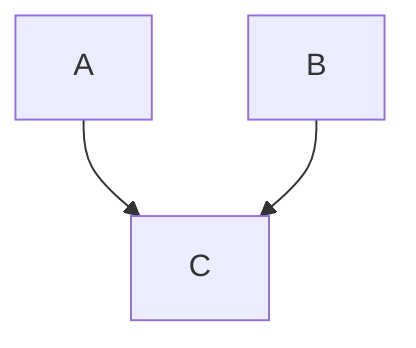
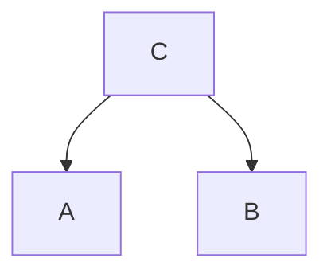

---


# 前置知识

> 笔记整理自：Bilibili站上[shuhuai008](https://space.bilibili.com/97068901)强势手推讲解的[白板推导CRF系列课程](https://www.bilibili.com/video/av34444816/?p=1)，课程质量很高！
>
> [条件随机场](https://www.yuque.com/bystander-wg876/yc5f72/ox2qgv)
>
> [【NLP】从隐马尔科夫到条件随机场](https://anxiang1836.github.io/2019/11/05/NLP_From_HMM_to_CRF/)

> 分类问题根据输出的类型，可以将其划分为`硬模型`和`软模型`

* **硬输出**: 输出为0或1

* **软输出**: 引入概率，不直接计算边界，而是计算取各类别的概率

## 软硬模型

### 硬模型

> svm支持向量机(最大间隔)

几何角度出发，求的是max margin classifier，式子最终的形式为
$$
min (\frac {1}{2} w^Tw) \qquad s.t. \ y_i(w^Tx_i+b) \geq1,i=1,\cdots,N
$$

> PLA感知机，可以看作最基本的神经元

$$
f(w) = sign(w^Tx)
$$

> LDA线性判别分析(误分类驱动)

核心思想: 类间大、类内小


### 软模型

#### 概率判别模型

> 建模核心

是对$$P(x,y)$$进行建模

> 例子_逻辑回归(Logistics Regression, LR)，或者也可以叫SoftMax Regression

> 例子_最大熵模型(Maximum Entropy Model, MEM)

利用最大熵思想(Maximum Entropy Model)驱动模型，从熵模型来看，LG是熵模型的一个特例

在最大熵原则下，如果给定均值和方差，那么Gaussian Dist熵最大

> 例子_最大熵马尔科夫模型(Maximum Entropy Markov Model, MEMM)

结合了MEM和HMM形成了MEMM，图模型可以表达成黄线部分(全局影响)或绿线部分(局部影响)，表达成绿线是为了和HMM对比


**潜在问题**: `标注偏差问题`

标注偏差问题(Label Bias Problem): 原因是因为`局部归一化`，上图中灰色虚线可以表达为$$p(y_2|y_1,x_2)$$，这部分要求符合概率分布，因此需要归一化，强制变为概率分布

**与其他模型的关系**

* 与HMM的关系

  HMM直接求联合概率分布，对于标注问题而言，显然不需要求联合概率分布，求条件概率就可以了，因此MEMM比HMM更简单

  打破了HMM的观测独立假设，比如$$y_2$$的标注不仅和$$x_1$$有关，也和$$x_2$$有关，甚至可以说和整个$$x$$都有关系，这个假设更加合理，观测间不应该是相互独立的

> CRF

将MEMM的**有向调整为了无向**，因此此时的归一化变为了全局归一化，解决了`标注偏差问题`


#### 概率生成模型

> 建模核心

是对$$P(y|x)$$进行建模

> 例子_朴素贝叶斯(Naive Bayes, NB)

`朴素贝叶斯假设`公式如下
$$
p(x|y=v_0) = \prod _{i=1}^{p}{p(x_i|y=1或0)}
$$
朴素贝叶斯模型简化为下图:


该图可以公式表达为$$x_i \bot x_j | y,i \neq j$$，意思是在给定$$y$$的情况下，$$x_i$$独立于$$x_j$$

或者可以解释为$$x_j$$和$$x_j$$之间受到$$y$$的阻隔，因此在给定$$y$$的情况下，$$x_i$$独立于$$x_j$$

> 例子_隐马尔科夫(Hidden Markov Model, HMM)

朴素贝叶斯中的$$y$$是分类问题，如果这里把$$y$$看作是一个标注问题，此时演化为序列预测


**HMM**有两个重要假设

`齐次Markov假设`：

`观测独立假设`：公式表达为$$x_i \bot x_j | y_i,i \neq j$$，意思是在给定$$y_i$$的情况下，$$x_i$$独立于$$x_j$$

> 例子_高斯混合模型(Gaussian mixture model, GMM)


NB-(0/1 变 seq)-> HMM

GMM-(+times)-> HMM

## 概率图模型结构

D-Separation是一种用来判断变量是否条件独立的图形化方法。换言之，对于一个DAG(有向无环图)E，D-Separation方法可以快速的判断出两个节点之间是否是条件独立的

> head-to-head(a->c<-b)



在c未知的条件下，a、b被阻断(blocked)，是独立的。反过来讲，在c已知的条件下，a、b是连通的，不独立。数学表示是
$$
\begin{align}
    P(a,b,c)&= P(a)*P(b)*P(c|a,b) \\
    \sum_c P(a,b,c)&=\sum_c P(a)*P(b)*P(c|a,b) \\
    P(a,b)&=P(a)*P(b)
\end{align}
$$

> tail-to-tail



在c给定的条件下，a，b被阻断(blocked)，是独立的。数学表示是
$$
\begin{align}
    P(a,b,c) &= P(c)*P(a|c)*P(b|c)  \\
    P(a,b|c) &= \frac{P(a,b,c)}{P(c)}  \\
    将式子1带  & 入到式子2中：\nonumber \\
    P(a,b|c) &=P(a|c)*P(b|c)
\end{align}
$$

> head-to-tail


在**c给定的条件下，a，b被阻断(blocked)，是独立的**。数学表示是$$P(a,b,c)=P(a)P(c|a)P(b|c)$$

化简后可得
$$
\begin{align}
P(a,b|c) &= \frac{P(a,b,c)}{P(c)}  \\
         &= \frac{P(a)*P(c|a)*P(b|c)}{P(c)}  \\
         &= \frac{P(a,c)*P(b|c)}{P(c)}  \\
         &= P(a|c)*P(b|c)
\end{align}
$$

## 无向图因子分解

这里的无向图以马尔科夫随机场MRF举例
$$
p(x) = \frac {1}{Z} \prod _{i=1}^{K}{\psi _i (x_{c_i})} = \frac {1}{Z} \prod _{i=1}^{K}{exp([-E_i(x_{c_i})])} = \frac {1}{Z} exp (\sum _{i=1}^{K} {F_i(x_{c_i})})
$$
其中，$$K$$是最大团的个数，$$C_i$$是第$$i$$个最大团，根据因子分解定理，要求势函数$$\psi _i \gt 0$$，$$x_{c_i}$$是最大团的表达

通常指定势函数$$\psi _i$$是一个指数函数，$$E_i(x_{c_i})$$是一个能量函数，$$F_i$$是$$-E_i$$的简化表达，都是一个函数

团的定义是子图中每个点都能相互连通

多个变量之间的联合概率分布能**基于团分解为多个因子的乘积**，每个因子仅与一个团相关


## 前后向算法

```python
import numpy as np


def cal_step(pa, pb, state, last):
    pa = np.array(pa)
    pb = np.array(pb)
    res = []
    for idx, s in enumerate(np.array(pb)[:, state]):
        tmp = sum([last[i] * a for i, a in enumerate(pa[:, idx])]) * s
        res.append(round(tmp, 4))
    return res


def cal_forward(pa, pb, ppi, po):
    """ 前向算法 """
    # 初始化状态
    init_state = [round(p * pb[idx][0], 4) for idx, p in enumerate(ppi)]
    print(init_state)

    state = init_state
    for step in range(1, len(po)):
        state = cal_step(pa=pa, pb=pb, state=po[step], last=state)
        print(state)

    print(round(sum(state), 4))


if __name__ == '__main__':
    pi = [0.2, 0.4, 0.4]
    B = [[0.5, 0.5], [0.4, 0.6], [0.7, 0.3], ]
    A = [[0.5, 0.2, 0.3], [0.3, 0.5, 0.2], [0.2, 0.3, 0.5], ]
    # 红 白 红
    O = [0, 1, 0]

    cal_forward(pa=A, pb=B, ppi=pi, po=O)
    print("结束")

```


# 演化

## HMM

> [马尔科夫随机场(MRF)在图像处理中的应用-图像分割、纹理迁移](https://oldpan.me/archives/markov-random-field-deeplearning)

HMM是一个生成模型，可以看成是NB或GMM的泛化

参数定义为$$\lambda = (\pi , A, B)$$，其中$$\pi$$是初始状态分布、$$A$$是y之间的状态转移矩阵($$y_t$$到$$y_{t+1}$$的概率)、$$B$$是从$$y$$发射到$$x$$的发射矩阵

**HMM有两个重要假设**(非必须，折中的方式，减少计算量)

`一阶齐次Markov假设`：

一阶: 含义为$$y_i$$只和$$y_{i-1}$$有关系，或者表述为给定$$y_{i-1}$$的情况下$$y_i$$和$$y_{i-2}$$是无关的，二阶的话就是给定$$y_{i-1}$$和$$y_{i-2}$$的情况下$$y_i$$和$$y_{i-3}$$是无关的

齐次: 含义为$$y_1, \cdots , y_i$$每个$$y$$的概率是是一致，也可以表述为$$p(y_t|y_{t+1})$$和$$p(y_{t-1}|y_{t-2})$$是相等的，也就是与时间$$t$$无关

术语化表达: $$p(y_t|y_{1:t-1},x_{1:t-1}) = p(y_t|y_{t-1})$$

`观测独立假设`：公式表达为$$x_i \bot x_j | y_i,i \neq j$$，意思是在给定$$y_i$$的情况下，$$x_i$$独立于$$x_j$$

术语化表达: $$p(x_t|y_{1:t-1},x_{1:t-1}) = p(x_t|y_{t})$$

**建模对象**如下
$$
p(X,Y| \lambda) = \prod _{t-1}^T{p(x_t, y_t| \lambda)} = \prod _{t-1}^T{p(y_t|y_{t-1}, \lambda)} \prod _{t-1}^T{p(x_t|y_{t}, \lambda)}
$$
计算复杂度太高，于是引入了前向后向算法

## MEMM


与HMM比较，将$$x$$变为了$$y$$的输入，此时给定$$y_t$$的情况下，$$x_t$$和$$x_{t-1}$$不是相互独立的，从而**打破观测独立性假设**

此时的MEMM建模对象变为了条件概率，为判别模型
$$
p(Y|X, \lambda) = \prod _{t=1}^T{p(y_t| y_{t-1}, x_{1:t}, \lambda)}
$$
在这里，判别式的模型比生成式模型要好

因为：任务驱动的，在这样的序列标注任务上，在给定一个待标注序列，我们更关注的是标注的是什么，因此，对于这样的任务我们只需要对条件概率建模就足矣了，而去求联合概率分布就将问题复杂化了(计算也复杂化了)

这里把整个输入$$X$$分成了2个部分，$$X=(x_g,x_{1:T})$$，即对$$Y$$的影响分成两个部分：全局的影响+局部的影响

主要缺点是会造成Label Bias Problem，（在John Lafferty论文中，指出了MEMM会造成Label Bias Problem问题）

看上方灰色框内的局部，可以简单看成是逻辑回归，在这个最小单元我们把它当成一个系统，系统从$$y_{t−1}$$到$$y_t$$的这样一个转移用数学可以表示成一个函数，是受$$y_{t−1}$$、$$y_t$$与$$x_t$$共同作用的一个函数，系统对外是有一定能量的，这个函数被称为`Mass Score`，而且是大于0的。但是问题出现在：这个Mass Score被局部归一化了。条件概率熵越小，那么对于观测值的考虑越少

> 为了能够更好地理解它的问题所在，这里举一个比较极端的[例子](https://anxiang1836.github.io/2019/11/05/NLP_From_HMM_to_CRF/)


比如，我们训练好了这样的一个模型，现有一个观测序列是rib

1. 在状态0时，由于$$P(4|0)>P(1|0)$$，所以我们选择从$$0→4$$转移路径；
2. 问题出现在了第二步转移上：由于$$P(5|4)=1$$，是受到了局部归一化的影响，从4状态转移仅有1条路径选择，其转移的条件概率为1，其所具有的熵值为0

为什么从4状态向5转移的条件概率为1

正是因为MEMM在每一步转移的概率都是要做**局部归一化**的，也就是说，从4状态向外转移的所有的情况加和要为1，在这里，仅有1中转移情况，所以$$P(5|4)=1$$

在这种情况下，无论观测值为什么，都不会影响$$4→5$$的转移，但是，这样标注出来的序列$$0→4→5→3$$，即rob就与客观事实不符了，这也就是问题的所在

## CRF

所以，为了解决局部归一化的问题，CRF取消了Y序列的转移方向，也就是取消了局部归一化，改变为了`全局归一化`  


# CRF

CRF是马尔科夫随机场MRF的特例，它假设马尔科夫随机场中只有𝑋和𝑌两种变量，𝑋一般是给定的，而𝑌一般是在给定𝑋的条件下我们的输出。这样马尔科夫随机场就特化成了条件随机场

* **条件**体现在它是判别式模型，计算条件概率
* **随机场**体现在是无向图模型，或者说是马尔科夫随机场MRF


图中$$y_0$$和$$y_{T+1}$$是为了表达上的方便

通常在没有说明的情况下，CRF指的就是线性链条件随机场

## 概率密度函数参数化

根据无向图因子分解公式，概率密度函数可以表达为
$$
p(Y|X) = \frac {1}{Z} exp (\sum _{i=1}^{K} {F_i(x_{c_i})}) = \frac {1}{Z} exp (\sum _{t=1}^{T} {F(y_{t-1},y_t, x_{1:T})})
$$
其中最大团$$x_{c_i}$$展开之后就是$$(y_{t-1},y_t, x_{1:T})$$

因为这里是线性链，每个结构都一样，没有必要为每一个都设一个函数，因此这里表达为$$F$$而不是$$F_i$$

接着，我们图中灰色框部分举例，这里可以把$$F(y_{t-1},y_t, x_{1:T})$$拆成三部分来看，$$y_t$$、$$y_{t-1}$$和它们之间边的关系
$$
F(y_{t-1},y_t, x_{1:T}) = \Delta_{y_{t-1}, x_{1:T}} + \Delta_{y_{t}, x_{1:T}} + \Delta_{y_{t-1}, t_{t}, x_{1:T}} = \Delta_{y_{t}, x_{1:T}} + \Delta_{y_{t-1}, t_{t}, x_{1:T}}
$$
前两个可以看成`状态函数`，第三个可以看成是`状态转移函数`

同时第一个可以忽略掉，原因在于目前是在$$t$$时刻，而在$$t-1$$时刻时，已经有$$y_{t-1}$$了，也就是上面的第二部分

> 这里的为什么可以把F拆成三部分呢，从图上看可能有些突兀，这里可以带入到`标注问题`来理解

比如这里有一句话: 小明 是 中国人

假设这里已经分过词了，这里要去判断词性，这里$$y_{t-1}$$和$$y_t$$是属于词性{名词、形容词、动词、...}的集合

因此这里前两个可以看成状态函数

而第三个就表示两个状态之间的转移函数

> 状态函数和转移函数

$$
\Delta_{y_{t-1}, t_{t}, x_{1:T}} = \sum _{k=1}^{K}{\lambda _k f_k(y_{t-1}, t_{t}, x_{1:T})}
$$

其中$$f_k$$是一个特征函数，一般是指示函数，比如$$f_k \lbrace y_{t-1}=名词, y_{t}=动词, x_{1:T} \rbrace = 1$$

$$\lambda _k$$是最终需要学习的参数

$$
\Delta_{y_{t}, x_{1:T}} = \sum _{l=1}^{L}{\eta _l g_l (y_t, x_{1:T})}
$$

其中$$\eta _l $$和$$ g_l$$的代表含义同上

> 带入得到最后的CRF条件概率密度函数

$$
p(Y|X) = \frac {1}{Z} exp (\sum _{i=1}^{K} {F_i(x_{c_i})}) = \frac {1}{Z} exp (\sum _{t=1}^{T} {F(y_{t-1},y_t, x_{1:T})}) = \\
\frac {1}{Z} exp (\sum _{t=1}^{T} [\sum _{k=1}^{K}{\lambda _k f_k(y_{t-1}, t_{t}, x_{1:T})} + \sum _{l=1}^{L}{\eta _l g_l (y_t, x_{1:T})}]
$$

写出概率密度函数之后，就可以求解了


机器学习基础（七）：概率图模型（HMM、MRF、CRF、话题模型、推断方法）

https://blog.csdn.net/weixin_44949421/article/details/120523212


概率图模型（PGM）（或简称图模型）在形式上是由图结构组成的。图的每个节点（[node](https://so.csdn.net/so/search?q=node&spm=1001.2101.3001.7020)）都关联了一个随机变量，而图的边（edge）则被用于编码这些随机变量之间的关系。

根据图是有向的还是无向的，我们可以将图的模式分为两大类——**贝叶斯网络**（ Bayesian network）和**马尔可夫网络**（Markov networks）


**0.概率图**：用图来表达变量之前相关关系的概率模型。其中图中的点表示一组随机变量，边表示随机变量之间的概率相关关系
 **1.有向图模型/贝叶斯网**：有向无环图。当变量之间有明确的因果关系时使用
 **2.无向图模型/马尔科夫网**：无向图。当变量之间有关系，但难以获得明确的因果关系时使用
 **3.生成式模型**：对联合概率进行建模，如隐马尔可夫模型、马尔可夫随机场
 **4.判别式模型**：对条件概率进行建模，如条件随机场


马尔可夫性

1.全局马尔可夫性：
给定两个变量子集的分离集，则这两个变量子集条件独立。

2.局部马尔可夫性：
给定某变量的邻接变量，则该变量相对其他变量条件独立。
3.对称马尔可夫性：
给定所有其他变量，两个非邻接变量条件独立。

对比MRF和CRF，都是使用团上的势函数来定义概率，只是一个是联合概率，一个是条件概率


7.1隐马尔可夫模型Hidden Markov Model，HMM

结构最简单的动态贝叶斯网dynamic Bayesian network，**生成式有向图模型**，主要用于时序数据建模（语音识别、自然语言处理等领域）


7.2马尔可夫随机场Markov Random Field，MRF

典型的马尔可夫网，**生成式无向图模型**


为满足非负性，**指数函数**常被用于定义势函数


每个状态的转移只依赖于之前的n个状态，这个过程被称为1个n阶的模型，其中n是影响转移状态的数目。最简单的马尔可夫过程就是一阶过程，**每一个状态的转移只依赖于其之前的那一个状态**，这个也叫作**马尔可夫性质**。


马尔可夫性质：一句话总结就是“未来只与现在有关”，即给定一个过程当前状态及历史的所有状态，其未来状态仅依赖于当前状态，与历史状态无关，这种性质叫做马尔科夫性质。这里比较有意思的事情是，有些非马尔可夫过程可以通过扩展“现在”和“未来”状态的概念来构造一个马尔可夫过程，这种情况称为二阶马尔可夫过程。以此类推，还可以构造更高阶的马尔可夫过程。


马尔可夫链：是一种最简单的马尔可夫过程，专指离散指数集的马尔可夫过程。经典的马尔可夫链主要是研究当前状态和未来状态之间的转移概率，并可以计算出多次试验之后的每个状态的概率分布，从而将看起来毫无规律的一些随机现象变成了整体有序的状态变化。


马尔可夫决策过程，是将马尔可夫性质应用于时序决策建模的方法，设定智能体的随机性策略和回报符合马尔可夫性质，这样就将智能体在与环境交互中的状态转移计算过程定义为马尔可夫性质的状态转移过程计算。通过使用动态规划、随机采样等方法，MDP可以求解使回报最大化的智能体策略。当今人工智能研究中火热的强化学习方向，方法的基石就是马尔可夫决策过程（Markov Decision Processes, MDP），这个方法是Bellman通过离散随机最优控制模型首次提出的，对于时序决策问题具有很好的建模能力。


隐马尔可夫模型，是对马尔可夫模型的扩展，这种模型的思想核心是把马尔科夫的状态转移设定为未知的隐含量，通过可观测的状态转移过程来估计隐含的状态，然后再用隐含状态来预计未来的变化，利用这种方法发现很多实际问题能够得到有效的建模，典型的应用包括了语音识别、生物信息科学的DNA分析和故障诊断等领域。


马尔可夫随机场，给随机场定义一种马尔可夫性质，即随机场中每个位置的属性定义是马尔可夫性的，简单理解就是随机场中每个位置的属性只与邻近的位置有关，与其他位置无关。这种方法被应用于图像分割取得较好效果。


**CRF和MRF区别**：MRF和CRF建模思路是不一样的，MRF是一种generative模型。

所谓generative模型就是需要先得出变量的概率模型参数，然后在进行推断任务。如bayes 推断中，可以先假定变量服从高斯分布，然后利用似然函数方法求取高斯分布的均值和方差这些参数，从而得出变量的概率分布模型，后期推断时依据该模型得出相应的结论。对于MRF模型而言，由于需要考虑观察变量y和标号变量x概率分布问题，这本身就是一个非常困难的问题。因为一般自然图片像素和其标号分布，很难采用一个简单的模型加以描述，MRF是表达这种模型的一种方法。对于某一张图片我们的兴趣点在于其标号，而不关心原始像素y的分布，所以没有必要花费资源考虑y的概率分布问题。CRF便是基于这一点，提出一种discriminative模型。

所谓discriminative模型，就是不用考虑原始变量实际的概率分布问题，直接研究标号推断问题。比如对于二分问题，我们可以直接获取其判别式h，当h>0时属于A类，反之属于B类。这样在不知道变量在A，B两类中的实际概率分布，便可以得出我们关心的分类结果。

MRF和CRF都是属于图理论中的问题，区别在于他们能量函数建立细节不同。MRF理论上需要显得出观察变量y和标号变量x的实际概率分布。但是由于计算能力的限制，这一点无法满足，所以目前研究中，采用了近似的方法。假定x的先验分布和y没有关系，只和相邻两节点有关。而y中某一个节点yi的分布只与当前标号变量xi有关，一般假定满足高斯分布。这样的假设是一种妥协，削弱了MRF的能力，但是便于计算实现。在自然图片中这些假设很难成立。

针对上面的问题，为了提高MRF的能力，同时保持其可计算性，CRF被提了出来。在CRF中xi和所有的观察变量y有关，这个构成节点能量，xi和xj也和所有的观察变量y有关，构成边缘能量。这样提高了MRF的适用性。CRF中节点能量和边缘能量均是通过discriminative方式实现，其中节点能量通过线性分类器实现。而在MRF中节点能量是通过generative模型实现，如高斯分布。


马尔可夫网络一般指马尔可夫随机场。 马尔可夫随机场（Markov Random Field），也有人翻译为马尔科夫随机场，马尔可夫随机场是建立在马尔可夫模型和贝叶斯理论基础之上的，它包含两层意思：一是什么是马尔可夫，二是什么是随机场


**条件随机场（Conditional random field，CRF）**是条件概率分布模型 P(Y|X) ，表示的是给定一组输入随机变量 X 的条件下另**一组输出**随机变量 Y 的马尔可夫随机场，也就是说 CRF 的特点是假设输出随机变量构成马尔可夫随机场。条件随机场可被看作是最大熵马尔可夫模型在标注问题上的推广


给出一个样本x，判别猫和狗，判别式模型直接可以用 arg⁡maxyP(y|x) 来进行判断，这也是判别式模型的建模目标；对于生成式模型，是通过看 ，猫P(x，Y=猫) 和 狗P(x,Y=狗) 谁大来进行判断。可以看出，**判别模型能更直接应用到分类任务中**，而生成模型用于分类任务时，还需要"绕"一下


[自然语言处理序列模型——MRF和CRF条件随机场](http://mp.ofweek.com/it/a456714949277)
